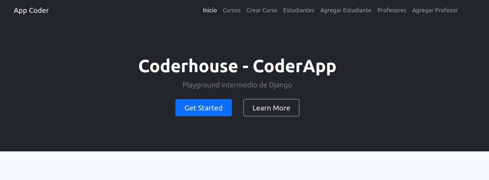

# Django-Entrega2

## Segunda Entrega de Django: Playground Intermedio

*Nombre: Villafañe, Roxana Noelia*

### Instalación

Instalación de Django

`$ python3 -m pip install Django`

Para correr el proyecto 

`$ python3 ./manage.py runserver`

En caso de necesitar realizar las migraciones

`$ python3 manage.py migrate`

`$ python3 manage.py makemigrations`

### Vistas

Para acceder al sitio, la url correspondiente 

`http://127.0.0.1:8000/coderapp/`

#### Vista de Cursos

La vista incluye un form de búsqueda incluido. 

`http://127.0.0.1:8000/coderapp/cursos/`

#### Vista de Estudiantes

La vista incluye un form de búsqueda incluido. 

`http://127.0.0.1:8000/coderapp/estudiantes/`

#### Vista de Profesores

La vista incluye un form de búsqueda incluido. 

`http://127.0.0.1:8000/coderapp/profesores/`

